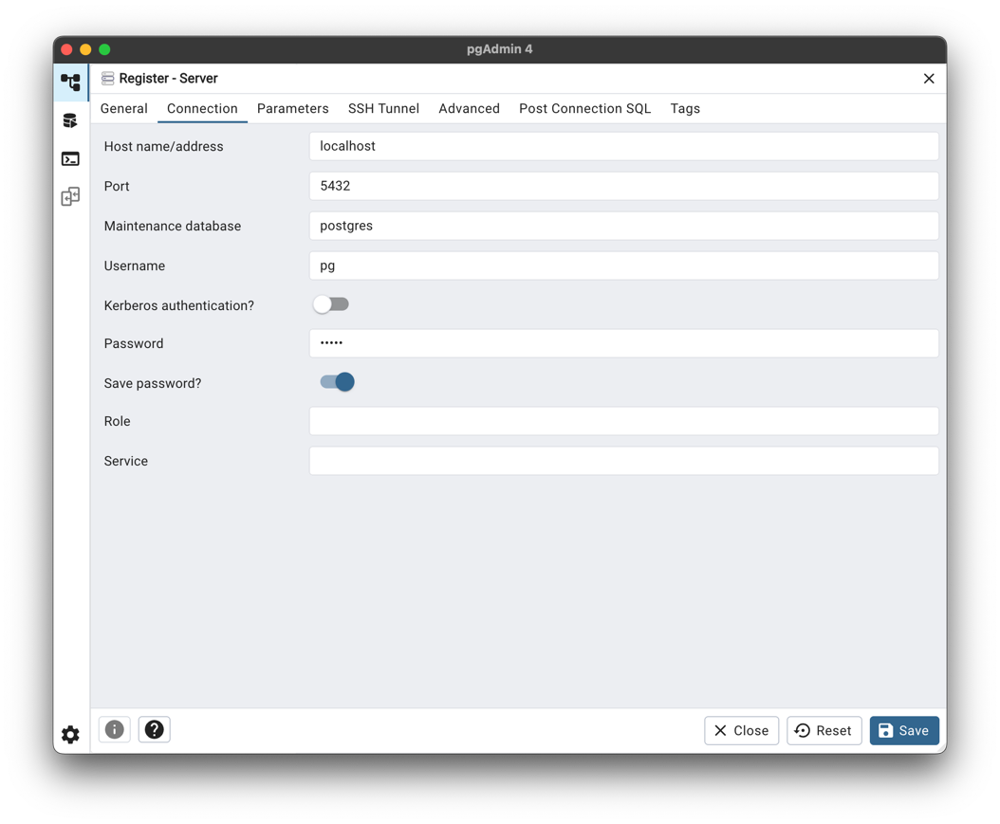
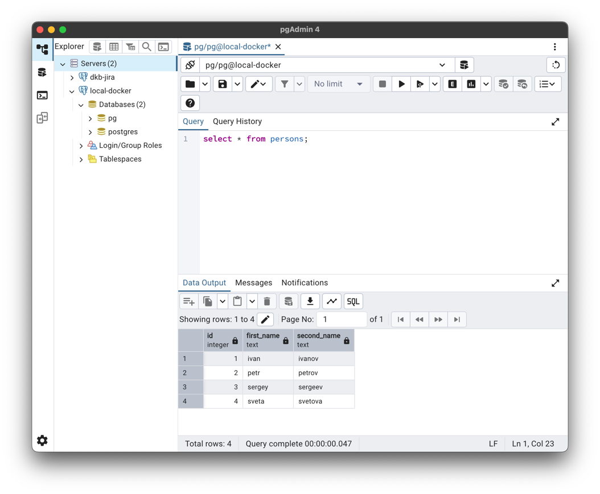

# Установка PostgreSQL в Docker

## Установка Docker Engine
Работа с Docker происходит локально на компьютере с MacOS. Установка Docker Engine детально описана в официальной документации: 
https://docs.docker.com/desktop/setup/install/mac-install/

## Запуск контейнера с PostgreSQL 17
Для развертывания создан файл [deploy/docker-compose.yml](../deploy/docker-compose.yml), который:
1. Создает Docker-контейнер с PostgreSQL 17 и пробросом стандартного порта 5432
2. Монтирует каталог `deploy/pg/master/data` в `/var/lib/postgresql/data` для хранения данных БД вне контейнера

Для запуска выполнить в терминале:
```shell
> cd deploy/
> docker-compose up -d
```

## Подключение к БД из контейнера с клиентом
Для запуска psql в контейнере используется тот же образ, что и для поднятия сервера. Отличительная особенность в том, что сервер не 
запускается. С учетом конфигурации в [deploy/docker-compose.yml](../deploy/docker-compose.yml) выполнить команду:
```shell
> docker run --rm -it --network deploy_pg postgres psql -h pg-master -U pg -d pg
```

Ввести пароль от пользователя pg, произойдет подключение к базе `pg`, где можно проверить данных через запрос. Лог консоли:
```shell
> docker run --rm -it --network deploy_pg postgres psql -h pg-master -U pg -d pg
Password for user pg: 
psql (17.5 (Debian 17.5-1.pgdg120+1))
Type "help" for help.

pg=# select * from persons;
 id | first_name | second_name 
----+------------+-------------
  1 | ivan       | ivanov
  2 | petr       | petrov
  3 | sergey     | sergeev
  4 | sveta      | svetova
(4 rows)
```

## Подключение к БД с локального компьютера
Так как контейнер развернут с пробросом стандартного порта 5432, остается только настроить на него соединение клиента, такого как 
pgAdmin4. Для этого:
1. Открыть pgAdmin4
2. Нажать ПКМ на Servers и выбрать пункт Register -> Server...
3. На вкладке General задать параметр Name = local-docker
4. На вкладке Connection задать параметры:
   1. Host name/address: localhost
   2. Post: 5432
   3. Maintenance database: postgres
   4. Username: pg
   5. Password: указан в [deploy/docker-compose.yml](../deploy/docker-compose.yml)
   6. Save password: yes
5. Нажать Save


После подключения проверьте возможность работы:


## Удаление контейнера и проверка сохранения данных
Для проверки, что данные в БД сохранятся после удаления контейнера достаточно выполнить несколько команд.

Остановить и удалить контейнер:
```shell
> docker-compose down
[+] Running 2/2
 ✔ Container pg-master  Removed                                                                                                                                                                           0.2s 
 ✔ Network deploy_pg    Removed
```
Проверить, что контейнера нет:
```shell
> docker ps -a
CONTAINER ID   IMAGE                  COMMAND                  CREATED        STATUS                      PORTS     NAMES
```
Поднять контейнер снова и подключиться описанным выше методом:
```shell
> docker-compose up -d
[+] Running 2/2
 ✔ Network deploy_pg    Created                                                                                                                                                                           0.0s 
 ✔ Container pg-master  Started
 
> docker run --rm -it --network deploy_pg postgres psql -h pg-master -U pg -d pg
Password for user pg: 
psql (17.5 (Debian 17.5-1.pgdg120+1))
Type "help" for help.
```
Проверить, что все данные на месте:
```sql
select * from persons;
--  id | first_name | second_name 
-- ----+------------+-------------
--   1 | ivan       | ivanov
--   2 | petr       | petrov
--   3 | sergey     | sergeev
--   4 | sveta      | svetova
-- (4 rows)
```
