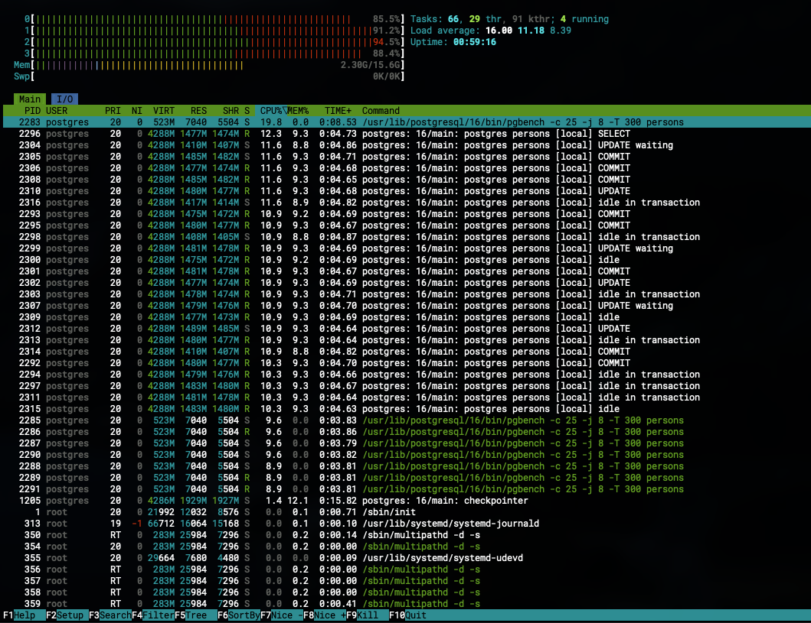
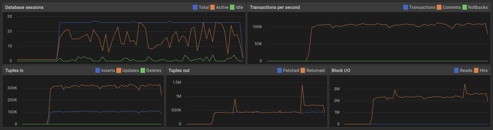

# Нагрузочное тестирование и тюнинг PostgreSQL
### Цели:
* сделать нагрузочное тестирование PostgreSQL
* настроить параметры PostgreSQL для достижения максимальной производительности

# Решение домашнего задания
Исходные данные:
* Виртуальная машина: Ubuntu 24.04.2 LTS, 16 Gb RAM, 4 CPU, 10 Gb SSD
* PostgreSQL: 16.9

## Настройка базовой производительности
В сервисе https://pgtune.leopard.in.ua/ выставить параметры системы:
* DB version: 16
* OS Type: Linux
* DB Type: Web application
* Total Memory: 16 Gb
* Number of CPUs: 4
* Number of Connections: 30
* Data Storage: SSD storage

Система выдает следующие рекомендации по настройках кластера:
```
# DB Version: 16
# OS Type: linux
# DB Type: web
# Total Memory (RAM): 16 GB
# CPUs num: 4
# Connections num: 30
# Data Storage: ssd

max_connections = 30
shared_buffers = 4GB
effective_cache_size = 12GB
maintenance_work_mem = 1GB
checkpoint_completion_target = 0.9
wal_buffers = 16MB
default_statistics_target = 100
random_page_cost = 1.1
effective_io_concurrency = 200
work_mem = 123361kB
huge_pages = off
min_wal_size = 1GB
max_wal_size = 4GB
max_worker_processes = 4
max_parallel_workers_per_gather = 2
max_parallel_workers = 4
max_parallel_maintenance_workers = 2
```
Настроить выставить их в [db.yml](../deploy/vm/group_vars/db.yml).
Примерить изменения на сервере командой:
```shell
> ansible-playbook playbooks/install_db.yml -l pg-master
```
После перезапуска сервера подключиться к нему и убедиться, что изменения применены с помощью запроса:
```sql
SELECT name, setting, boot_val, source
FROM pg_settings
WHERE setting <> boot_val;
```
## Тестирование производительности
Зайти на сервер по SSH и выполнить нагрузочное тестирование с помощью pgbench:
```shell
> sudo su - postgres
> pgbench -i -s 100 persons
> pgbench -c 25 -j 8 -T 300 persons
```
Что запустит нагрузочное тестирование на базу `persons` с параметрами: 25 клиентов отправляло запросы в 8 потоков на протяжении 5 минут. 
После завершения теста будет выведен отчет:
```
pgbench (16.9 (Ubuntu 16.9-0ubuntu0.24.04.1))
starting vacuum...end.
transaction type: <builtin: TPC-B (sort of)>
scaling factor: 100
query mode: simple
number of clients: 25
number of threads: 8
maximum number of tries: 1
duration: 300 s
number of transactions actually processed: 6279184
number of failed transactions: 0 (0.000%)
latency average = 1.195 ms
initial connection time = 10.725 ms
tps = 20928.976687 (without initial connection time)
```
Из которого видно, что текущий TPS (transaction per second) равен 20,928.

**Дисклеймер**: pgbench не дает абсолютного значения TPS при любых условиях и сильно зависит не только от производительности сервера, но 
и от выбранного профиля нагрузки. Так, если вы укажете слишком малое количество клиентов, то не задействуете всю производительность CPU 
и получите меньшее количество TSP на выходе. Поэтому, эмпирически выявлены следующие параметры: 

Клиенты (-с) = `max_connections - 5`, чтобы задействовать практически все доступные подключения
Потоки (-j) = `max_worker_processes * 2`, чтобы задействовать hyperthreading
Время теста (-T) = 300-600, чтобы получить более точные результаты

Если же менять параметры в большую или меньшую сторону, то значение TSP может упасть в два и более раз.

### Скриншоты во время теста
Команда htop:

Графики в PgAdmin4:


# Решение задания со *
## Подготовка
Установить https://github.com/akopytov/sysbench:
```shell
> curl -s https://packagecloud.io/install/repositories/akopytov/sysbench/script.deb.sh | sudo bash
> sudo apt -y install sysbench
```

Создать БД для тестов:
```sql
CREATE DATABASE tpcc;
```

Загрузить тестовые данные (под УЗ postgres) командой ниже.

**Внимание!** Параметр `scale=10` отвечает за кол-во данных, размещенных в таблицах и может потребовать диск большого размера. Например: 
при значении в 10 требуется не менее 15Gb.
```shell
> ./tpcc.lua \
  --pgsql-host=localhost \
  --pgsql-port=5432 \
  --pgsql-user=postgres \
  --pgsql-password=postgres \
  --pgsql-db=tpcc \
  --tables=10 \
  --scale=10 \
  --use_fk=0 \
  --threads=20 \
  --db-driver=pgsql \
  prepare
```

Выполнить через psql:
```sql
VACUUM ANALYZE;
```

## Запуск теста
```shell
./tpcc.lua \
  --pgsql-host=localhost \
  --pgsql-port=5432 \
  --pgsql-user=postgres \
  --pgsql-password=postgres \
  --pgsql-db=tpcc \
  --tables=10 \
  --scale=10 \
  --use_fk=0 \
  --time=300 \
  --threads=20 \
  --report-interval=1 \
  --db-driver=pgsql \
  run
```

## Расшифровка результата
```
SQL statistics:
    queries performed:
        read:                            5427229
        write:                           5632177
        other:                           853490
        total:                           11912896
    transactions:                        414339 (1380.91 per sec.)
    queries:                             11912896 (39703.41 per sec.)
    ignored errors:                      14203  (47.34 per sec.)
    reconnects:                          0      (0.00 per sec.)

General statistics:
    total time:                          300.0468s
    total number of events:              414339

Latency (ms):
         min:                                    0.14
         avg:                                   14.48
         max:                                  733.63
         95th percentile:                       33.12
         sum:                              5999799.17

Threads fairness:
    events (avg/stddev):           20716.9500/93.83
    execution time (avg/stddev):   299.9900/0.01
```
Где:

**Статистика SQL-запросов**

read: 5,427,229 — количество выполненных операций чтения (SELECT).\
write: 5,632,177 — количество операций записи (INSERT, UPDATE, DELETE).\
other: 853,490 — прочие запросы (например, транзакционные команды, коммиты).\
total: 11,912,896 — общее число SQL-запросов за время теста.\
transactions: 414,339 (1380.91 per sec.) — количество успешно выполненных транзакций и их средняя скорость в секунду (TPS, 
  transactions per second). Это главный показатель производительности.\
queries: 11,912,896 (39,703.41 per sec.) — общее число запросов и их средняя скорость в секунду.\
ignored errors: 14,203 (47.34 per sec.) — количество игнорируемых ошибок (например, конфликтов блокировок), что говорит о наличии 
  некоторой нагрузки и конкуренции.\
reconnects: 0 — число переподключений к базе (в данном случае отсутствуют).

**Общая статистика**

total time: 300.0468s — общее время теста (примерно 5 минут).\
total number of events: 414,339 — число обработанных событий (транзакций).

**Задержки в миллисекундах**

min: 0.14 ms — минимальное время отклика транзакции.\
avg: 14.48 ms — среднее время отклика транзакции.\
max: 733.63 ms — максимальная задержка (возможно, редкие пики нагрузки).\
95th percentile: 33.12 ms — 95% транзакций выполнялись быстрее этого времени, что важно для оценки стабильности.\
sum: 5,999,799.17 ms — суммарное время всех транзакций.

**Справедливость распределения нагрузки между потоками**

events (avg/stddev): 20,716.95 / 93.83 — среднее и стандартное отклонение количества транзакций на поток, показывает равномерность 
  распределения.\
execution time (avg/stddev): 299.99 / 0.01 — среднее и отклонение времени работы каждого потока, что говорит о стабильной нагрузке.
