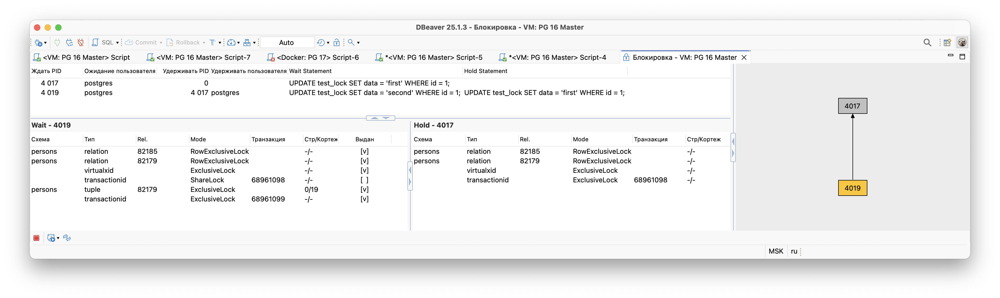

# Механизм блокировок

Цель: понимать как работает механизм блокировок объектов и строк

# Решение домашнего задания

Для начала настроим новые параметры в `postgresql.conf`:

```
log_lock_waits = on
deadlock_timeout = 200ms
```

Все настройки производятся через файл [db.yml](../deploy/vm/group_vars/db.yml), а после их сохранения применяются на сервере командой:

```shell
> ansible-playbook playbooks/install_db.yml -l db
```

## Эмуляция блокировки и чтение лог файла

Для чтения лог-файла переходив в каталог `/mnt/pg_data/main/log` и открываем последний созданный файл. Как найти каталог с логами
описано в предыдущем домашнем задании.

```shell
> tail -f /mnt/pg_data/main/log/postgresql-2025-08-03_145845.log
```

Далее открываем две сессии в pgAdmin4 и последовательно выполняем команды ниже.

### Простая блокировка

В первой сессии создадим таблицу и наполним ее данными:

```sql
CREATE TABLE test_lock(id SERIAL PRIMARY KEY, data TEXT);
INSERT INTO test_lock(data) VALUES ('a'), ('b'), ('c');
```

Далее начнем новую транзакцию и поменяем первую запись:

```sql
BEGIN;
UPDATE test_lock SET data = 'first' WHERE id = 1;
```

Во второй сессии откроем новую транзакцию и начнем менять ту же запись:

```sql
BEGIN;
UPDATE test_lock SET data = 'second' WHERE id = 1;
```

Видим, что вторая сессия "висит", а в логах появилась информация о блокировках:

```
2025-08-06 03:41:18.855 UTC [4019] postgres@persons LOG:  process 4019 still waiting for ShareLock on transaction 68961098 after 204.241 ms
2025-08-06 03:41:18.855 UTC [4019] postgres@persons DETAIL:  Process holding the lock: 4017. Wait queue: 4019.
2025-08-06 03:41:18.855 UTC [4019] postgres@persons CONTEXT:  while updating tuple (0,19) in relation "test_lock"
2025-08-06 03:41:18.855 UTC [4019] postgres@persons STATEMENT:  UPDATE test_lock SET data = 'second' WHERE id = 1;
2025-08-06 03:41:26.841 UTC [4019] postgres@persons LOG:  process 4019 still waiting for ShareLock on transaction 68961098 after 8190.083 ms
2025-08-06 03:41:26.841 UTC [4019] postgres@persons DETAIL:  Process holding the lock: 4017. Wait queue: 4019.
2025-08-06 03:41:26.841 UTC [4019] postgres@persons CONTEXT:  while updating tuple (0,19) in relation "test_lock"
2025-08-06 03:41:26.841 UTC [4019] postgres@persons STATEMENT:  UPDATE test_lock SET data = 'second' WHERE id = 1;
```

С помощью DBeaver смотрим на информацию о блокировке из которой следует, что процесс 4019 ждет завершения транзакции в процессе 4017.


Делаем `COMMIT` в первой сессии, после чего вторая освобождается. В логах появляет сообщение об этом:

```
2025-08-06 03:52:12.232 UTC [4019] postgres@persons LOG:  process 4019 acquired ShareLock on transaction 68961098 after 653581.502 ms
2025-08-06 03:52:12.232 UTC [4019] postgres@persons CONTEXT:  while updating tuple (0,19) in relation "test_lock"
2025-08-06 03:52:12.232 UTC [4019] postgres@persons STATEMENT:  UPDATE test_lock SET data = 'second' WHERE id = 1;
```

### Взаимоблокировка (deadlock)

Воспроизвести взаимоблокировку достаточно просто, нам понадобится две сессии из раздела выше (убедитесь, что сделали commit/rollback).

В первой сессии начинаем транзакцию и меняем первую запись:

```sql
BEGIN;
UPDATE test_lock SET data = 'first' WHERE id = 1;
```

Во второй сессии меняем сначала вторую, потом первую записи:

```sql
BEGIN;
UPDATE test_lock SET data = 'second' WHERE id = 2;
UPDATE test_lock SET data = 'second' WHERE id = 1;
```

Мы снова вошли в блокировку, о чем сообщается в логах:

```
2025-08-06 03:57:39.699 UTC [4019] postgres@persons LOG:  process 4019 still waiting for ShareLock on transaction 68961100 after 200.169 ms
2025-08-06 03:57:39.699 UTC [4019] postgres@persons DETAIL:  Process holding the lock: 4017. Wait queue: 4019.
2025-08-06 03:57:39.699 UTC [4019] postgres@persons CONTEXT:  while updating tuple (0,22) in relation "test_lock"
2025-08-06 03:57:39.699 UTC [4019] postgres@persons STATEMENT:  UPDATE test_lock SET data = 'second' WHERE id = 1;
```

Теперь в первой сессии поменяем вторую запись, которую изменили в незавершенной транзакции второй сессии:

```sql
UPDATE test_lock SET data = 'first' WHERE id = 2;
```

И видим, как первая сессия закрылась с состоянием `aborted`, а в логах появилась информацию о взаимоблокировке:

```
2025-08-06 03:59:29.262 UTC [4017] postgres@persons LOG:  process 4017 detected deadlock while waiting for ShareLock on transaction 68961101 after 200.171 ms
2025-08-06 03:59:29.262 UTC [4017] postgres@persons DETAIL:  Process holding the lock: 4019. Wait queue: .
2025-08-06 03:59:29.262 UTC [4017] postgres@persons CONTEXT:  while updating tuple (0,2) in relation "test_lock"
2025-08-06 03:59:29.262 UTC [4017] postgres@persons STATEMENT:  UPDATE test_lock SET data = 'first' WHERE id = 2;
2025-08-06 03:59:29.263 UTC [4017] postgres@persons ERROR:  deadlock detected
2025-08-06 03:59:29.263 UTC [4017] postgres@persons DETAIL:  Process 4017 waits for ShareLock on transaction 68961101; blocked by process 4019.
	Process 4019 waits for ShareLock on transaction 68961100; blocked by process 4017.
	Process 4017: UPDATE test_lock SET data = 'first' WHERE id = 2;
	Process 4019: UPDATE test_lock SET data = 'second' WHERE id = 1;
2025-08-06 03:59:29.263 UTC [4017] postgres@persons HINT:  See server log for query details.
2025-08-06 03:59:29.263 UTC [4017] postgres@persons CONTEXT:  while updating tuple (0,2) in relation "test_lock"
2025-08-06 03:59:29.263 UTC [4017] postgres@persons STATEMENT:  UPDATE test_lock SET data = 'first' WHERE id = 2;
2025-08-06 03:59:29.263 UTC [4019] postgres@persons LOG:  process 4019 acquired ShareLock on transaction 68961100 after 109763.986 ms
2025-08-06 03:59:29.263 UTC [4019] postgres@persons CONTEXT:  while updating tuple (0,22) in relation "test_lock"
2025-08-06 03:59:29.263 UTC [4019] postgres@persons STATEMENT:  UPDATE test_lock SET data = 'second' WHERE id = 1;
```

Таким образом первая сессия прервала свою работу, так как она первая обнаружила взаимоблокировку.

## Выводы

Блокировки — неотъемлемая действительность при конкурентном доступе к данным. Поэтому с этим надо учиться работать и не забывать
устанавливать параметр `log_lock_waits` и подбирать `deadlock_timeout` под каждую систему.

А чтобы не допускать взаимоблокировки для разработчиков:

1. Все транзакции должны изменять записи в определенном порядке, например по первичному ключу. Чтобы разные транзакции не меняли одни и
   те же записи идя друг другу на встречу.
2. Делать максимально короткие транзакции
3. Не допускать взаимодействия с пользователем в рамках открытой транзакции (No user interaction on transaction). Транзакция вначале должна
   собрать все данные от пользователя и после этого запуститься
4. Скрывать взаримоблокировки. Перехватывать их на уровне кода и повторять запрос через некоторое время (напр.: 0.5 секунды).
   Не забывать, что после нескольких неудачных попыток (напр.: 3) всё же выдать ошибку.

# Задание со *

Отвечаем на вопрос: Могут ли две транзакции, выполняющие единственную команду UPDATE одной и той же таблицы (без where), заблокировать друг
друга?

Используем те же две сессии из разделов выше. В первой сессии запустим изменение всей таблицы:

```sql
BEGIN;
UPDATE test_lock SET data = 'first';
```

Во второй сделаем тоже самое:

```sql
BEGIN;
UPDATE test_lock SET data = 'second';
```

Вторая сессия "зависнет", а в логах появится информация о блокировке:

```
2025-08-06 04:22:13.258 UTC [4019] postgres@persons LOG:  process 4019 still waiting for ShareLock on transaction 68961104 after 203.235 ms
2025-08-06 04:22:13.258 UTC [4019] postgres@persons DETAIL:  Process holding the lock: 4017. Wait queue: 4019.
2025-08-06 04:22:13.258 UTC [4019] postgres@persons CONTEXT:  while updating tuple (0,2) in relation "test_lock"
2025-08-06 04:22:13.258 UTC [4019] postgres@persons STATEMENT:  BEGIN;
	UPDATE test_lock SET data = 'second';
```

Таким образом изменения без `WHERE` может привести к блокировке. Чтобы этого избегать, когда требуется массовое изменение таблицы, можно 
применить ручную блокировку:

```sql
/* 
Блокировка всей таблицы на запись. Подходит для случаев, когда:
 - проводим массовую загрузку данных
 - по всей таблицу проводим какие-то работы, типо массовых изменений данных
 - делаем full vacuum
*/
begin;
	lock table persons in exclusive mode; -- читать можно, изменять нельзя
	-- проводим обновление данных
commit; -- обязательно, чтобы снять блокировку

/*
Блокировка всей таблицы на чтение/запись.
*/
begin;
	lock table persons in access exclusive mode;
	-- проводим обновление данных
commit; -- обязательно, чтобы снять блокировку

/*
Блокировка всех строк сотрудников, которые являются программистами. Для чтения они остаются доступны.
*/
begin;
	select * from persons where job_id = 'IT_PROG' for update;
	-- проводим обновление данных
commit; -- обязательно, чтобы снять блокировку
```
